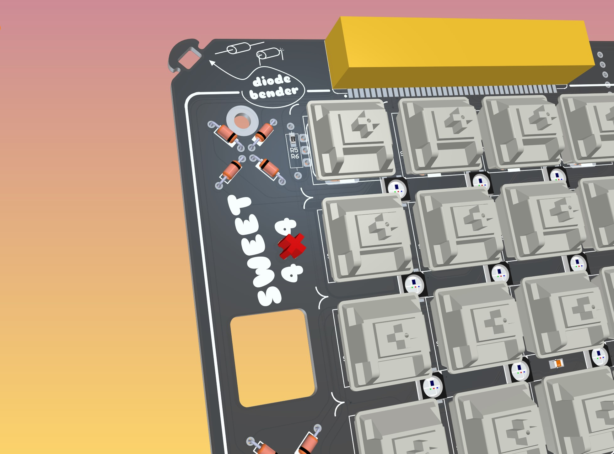

# Fri3d_Sweet4x4

The progress and more detailts about this project can be found on [Hackaday.io](https://hackaday.io/project/186574-sweet-4x4)

This PCB has, besides the required layout for a 4x4 keypad, some nifty features which will help during assembly and maintenance. The left most corner contains a diode bending corner, making sure that your diodes have their leads bent in the right spot will help during assembly. The other useful feature if a built in lube station. The X cutout will snugly fit a stem whilst the rectangular hole will  fit the body the switch you're cleaning.

