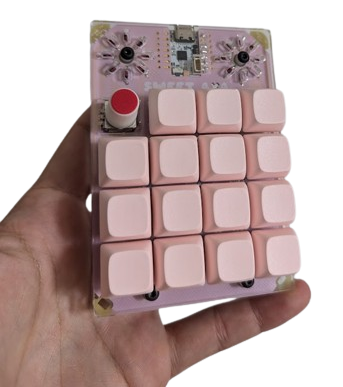
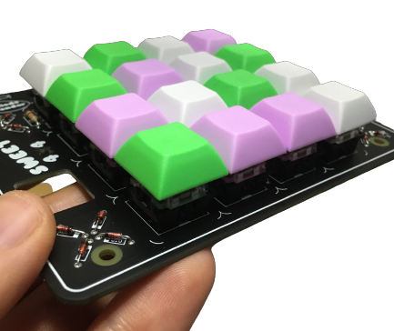

# Sweet4x4 REV02

[Manual on how to assemble can be found here](https://fri3dcamp.github.io/badge_2024/sweet4x4/) Revision `02` no longer requires the Fri3d badge but instead relies solely on the us of a [TNY, QT Py or XIAO board](https://github.com/adafruit/awesome-qt-py). For the workshop during [Fri3d Camp](https://fri3d.be/) we opted for the [LANA TNY](https://phyx.be/LANA_TNY/).

There is an issue with the LEDs, when pushed too far in the footprint they tend to break. In order to prevent damaging the LEDs we sugges mounting only 6 on the bottom and use them for underglow.

# Fri3d_Sweet4x4 REV01

## About
The progress and more details about this project can be found on [Hackaday.io](https://hackaday.io/project/186574-sweet-4x4)

This PCB has, besides the required layout for a 4x4 keypad, some nifty features which will help during assembly and maintenance. The left most corner contains a diode bending corner, making sure that your diodes have their leads bent in the right spot will help during assembly. The other useful feature if a built in lube station. The X cutout will snugly fit a stem whilst the rectangular hole will  fit the body the switch you're cleaning.

## Getting started
### Using the Fri3d Camp 2022 badge
The Fri3d Badge has an ESP32 on board, because of the chip the badge uses we can only create a 4x4 Bluetooth keyboard.
1. Make sure you have Arduino IDE installed
2. Add the ESP32 board to the Arduino board manager, I think this link works well : https://randomnerdtutorials.com/installing-the-esp32-board-in-arduino-ide-windows-instructions/
3. Add the libraries you need
  - BLEKeyboard : https://github.com/T-vK/ESP32-BLE-Keyboard
  - Keypad : https://github.com/Chris--A/Keypad
  - Badge2020 : https://github.com/Fri3dCamp/Badge2020_arduino
  - Neopixel : https://github.com/adafruit/Adafruit_NeoPixel
4. Open the Sweet_4x4_minimal.ino code in the Arduino IDE, this only includes code to turn the pcb + badge into a BLE keyboard (not using screen or RGB leds)
5. Optionally you can use the Sweet_4x4_full.ino code, this also include some basic code to get the TFT screen to work

### Using a XIAO module
This allows to use the 4x4 PCB as a HID device over USB-C
Updating soon
